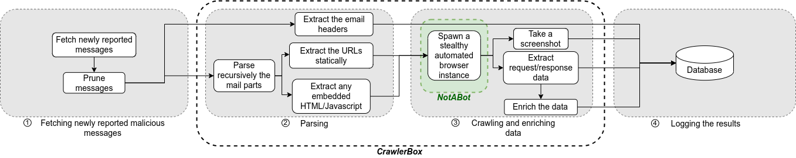

# CrawlerBox
## Description
*CrawlerBox* is an automated analysis framework designed for parsing emails and crawling embedded web resources. This infrastructure was developed to facilitate the study of evasive phishing emails reported by end users.

For more detailed information on *CrawlerBox*, its functionality, and the results obtained, please refer to our paper "[A Closer Look at Modern Evasive Phishing Emails](https://example.com)".
<figure>
    
    <figcaption>Figure 1: CrawlerBox Analysis Pipeline</figcaption>
</figure>


## Getting started
### Installation 
```bash
git clone https://github.com/AmadeusITGroup/CrawlerBox.git
cd CrawlerBox
```
### Configuration 
*CrawlerBox* relies on external services to operate (e.g., Cisco Umbrella and Shodan for data enrichment). Additionally, it connects to two external servers: one database for retrieving newly user-reported messages and another for storing the obtained results. Before running *CrawlerBox*, you must configure these dependencies. Please use the `config.py` file accordingly.

Please also consider rewriting the functions in `personalized_config.py`: `fetch_new_emails_by_date`, `fetch_new_emails_by_id`, and `url_rewrite`. The two first functions should match your implemetation for fetching newly reported emails, and `url_rewrite` is designed to extract and return a decoded URL from a given string. In case the URLs within the messages are rewritten (e.g., rewritten by Microsoft's Safe Links or Proofpoint's URL Defense), you might need to decode these URLs before loading them by the crawler.


## Citation
Please consider citing our paper if you find it useful:

```bibtex
@book{boulila2025,
  title = {A Closer Look at Modern Evasive Phishing Emails},
  author = {Boulila, Elyssa and Dacier, Marc and Vengadessa Peroumal, Siva Prem and Veys, Nicolas and Aonzo, Simone},
  booktitle={2025 55th Annual IEEE/IFIP International Conference on Dependable Systems and Networks (DSN)},
  year = {2025},
  organization = {IEEE}
}